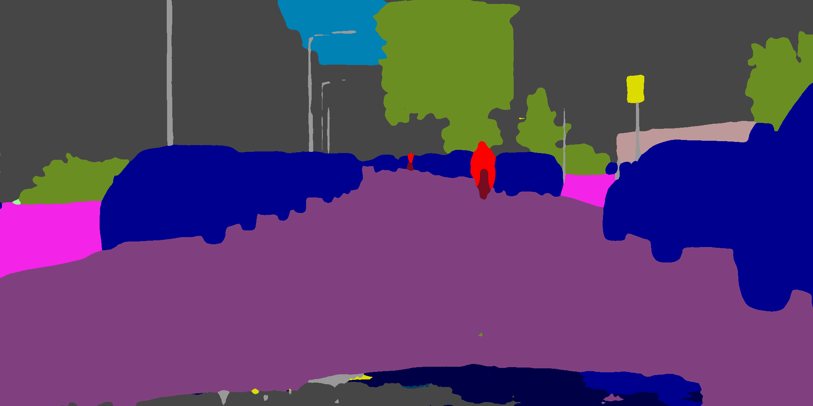
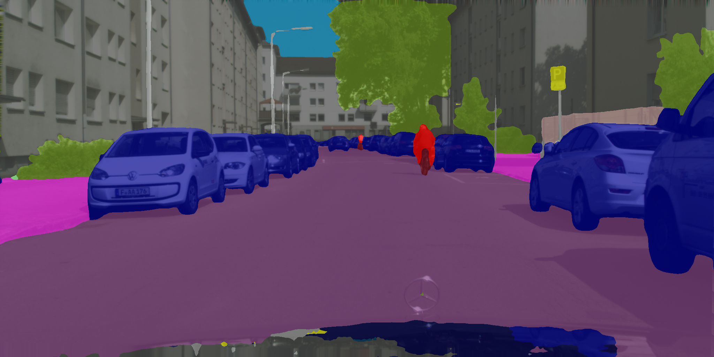

#  CIRKDV2: Cross-Image Relational Knowledge Distillation with Contextual Modeling for Efficient Semantic Segmentation

This repository contains the source code of CIRKDV2 and implementations of semantic segmentation distillation methods on popular datasets.


## Requirement


Ubuntu 22.04 LTS

Python 3.9 ([Anaconda](https://www.anaconda.com/) is recommended)

CUDA 12.4

Install python packages:
```
pip install -r requirements.txt
```

Backbones pretrained on ImageNet-1K:

| Type | Backbone | Pretrained |
| -- | -- | -- |
| CNN | ResNet-101 |[Download](https://drive.google.com/file/d/1V8-E4wm2VMsfnNiczSIDoSM7JJBMARkP/view?usp=sharing)|
| CNN | ResNet-18 | [Download](https://github.com/winycg/CIRKD/releases/download/backbonev0.1/resnet18-imagenet.pth) |
| CNN | MobileNetV3-Small | [Download](https://github.com/winycg/CIRKD/releases/download/backbonev0.1/mobilenet_v3_small-47085aa1.pth) |
| CNN | MobileNetV3-Large | [Download](https://github.com/winycg/CIRKD/releases/download/backbonev0.1/mobilenet_v3_large-bc2c3fd3.pth) |
| Transformer | MobileViT-XXS | [Download](https://github.com/winycg/CIRKD/releases/download/backbonev0.1/mobilevit-xxsmall_3rdparty_in1k_20221018-77835605.pth) |
| Transformer | MiT-B0 | [Download](https://github.com/winycg/CIRKD/releases/download/backbonev0.1/mit_b0.pth) |
| Transformer | MiT-B4 | [Download](https://github.com/winycg/CIRKD/releases/download/backbonev0.1/mit_b4.pth) |


Supported datasets:

| Dataset | Train Size | Val Size | Test Size | Class | Link |
| -- | -- | -- |-- |-- |-- |
| Cityscapes | 2975 | 500 | 1525 |19| [Download](https://www.cityscapes-dataset.com/downloads/)|
| Pascal VOC Aug | 10582 | 1449 | -- | 21 |[Download](https://github.com/winycg/CIRKD/releases/download/segdataset/VOCAug.zip) |
| CamVid | 367 | 101 | 233 | 11 | [Download](https://github.com/winycg/CIRKD/releases/download/segdataset/CamVid.zip)|
| ADE20K | 20210 | 2000 | -- | 150 | [Download](https://drive.google.com/file/d/10cCHvCZ3HTxtE9iaSlMcMF0oDgtMpVF8/view?usp=share_link )|
| COCO-Stuff-164K | 118287 | 5000 |-- | 182 | [Download](https://github.com/nightrome/cocostuff)|

## Distillation performance on Cityscapes

| Role | Network |Method | Test mIoU | Pretrained | Script |
| -- | -- | -- |-- |-- |-- |
|  Teacher | DeepLabV3-ResNet101| -|78.30 | [Download](https://github.com/winycg/CIRKD/releases/download/segv0.1/deeplabv3_resnet101_citys_best_model.pth) | -| 
|  Student | DeepLabV3-ResNet18| Baseline | 73.56 | -| [Train](https://github.com/winycg/CIRKD/tree/main/scripts/train_baseline/cityscapes/deeplabv3_resnet18.sh)\|[Eval](https://github.com/winycg/CIRKD/tree/main/scripts/evaluation/cityscapes/deeplabv3_resnet18.sh)| 
|  Student | DeepLabV3-ResNet18| CIRKDV2 | 75.60| [Download](https://github.com/winycg/CIRKD/releases/download/segv0.1/kd_deeplabv3_resnet18_citys_best_model.pth)| [Train](https://github.com/winycg/CIRKD/tree/main/scripts/train_cirkdv2/cityscapes/deeplabv3_resnet18.sh)\|[Eval](https://github.com/winycg/CIRKD/tree/main/scripts/evaluation/cityscapes/deeplabv3_resnet18.sh)| 
|  Student | UperNet-ResNet18| Baseline | 68.90 |- | [Train](https://github.com/winycg/CIRKD/tree/main/scripts/train_baseline/cityscapes/upernet_resnet18.sh)\|[Eval](https://github.com/winycg/CIRKD/tree/main/scripts/evaluation/cityscapes/upernet_resnet18.sh)| 
|  Student | UperNet-ResNet18| CIRKDV2 | 72.11| [Download](https://github.com/winycg/CIRKD/releases/download/segv0.1/kd_upernet_lite_resnet18_citys_best_model.pth)| [Train](https://github.com/winycg/CIRKD/tree/main/scripts/train_cirkdv2/cityscapes/upernet_resnet18.sh)\|[Eval](https://github.com/winycg/CIRKD/tree/main/scripts/evaluation/cityscapes/upernet_resnet18.sh)| 
|  Student | DeepLabV3-MobileNetV3-Small| Baseline | 65.05 |- | [Train](https://github.com/winycg/CIRKD/tree/main/scripts/train_baseline/cityscapes/deeplabv3_mobilenetv3_small.sh)\|[Eval](https://github.com/winycg/CIRKD/tree/main/scripts/evaluation/cityscapes/deeplabv3_mobilenetv3_small.sh)| 
|  Student | DeepLabV3-MobileNetV3-Small| CIRKDV2 | 67.62|[Download](https://github.com/winycg/CIRKD/releases/download/segv0.1/kd_deeplabv3_mobilenet_ssseg_mobilenetv3_small_citys_best_model.pth) | [Train](https://github.com/winycg/CIRKD/tree/main/scripts/train_cirkdv2/cityscapes/deeplabv3_mobilenetv3_small.sh)\|[Eval](https://github.com/winycg/CIRKD/tree/main/scripts/evaluation/cityscapes/deeplabv3_mobilenetv3_small.sh)| 
|  Student | PSPNet-MobileNetV3-Small| Baseline | 62.78 | -| [Train](https://github.com/winycg/CIRKD/tree/main/scripts/train_baseline/cityscapes/pspnet_mobilenetv3_small.sh)\|[Eval](https://github.com/winycg/CIRKD/tree/main/scripts/evaluation/cityscapes/pspnet_mobilenetv3_small.sh)| 
|  Student | PSPNet-MobileNetV3-Small| CIRKDV2 | 65.42| [Download](https://github.com/winycg/CIRKD/releases/download/segv0.1/kd_psp_mobile_mobilenetv3_small_citys_best_model.pth)| [Train](https://github.com/winycg/CIRKD/tree/main/scripts/train_cirkdv2/cityscapes/pspnet_mobilenetv3_small.sh)\|[Eval](https://github.com/winycg/CIRKD/tree/main/scripts/evaluation/cityscapes/pspnet_mobilenetv3_small.sh)| 
|  Student | DeepLabV3-MobileViT-XXS| Baseline | 66.24 | -| [Train](https://github.com/winycg/CIRKD/tree/main/scripts/train_baseline/cityscapes/deeplabv3_mobilevit_xxs.sh)\|[Eval](https://github.com/winycg/CIRKD/tree/main/scripts/evaluation/cityscapes/deeplabv3_mobilevit_xxs.sh)| 
|  Student | DeepLabV3-MobileViT-XXS| CIRKDV2 | 68.91| [Download](https://github.com/winycg/CIRKD/releases/download/segv0.1/kd_deeplab_mobile_mobilevit_xx_small_citys_best_model.pth)|[Train](https://github.com/winycg/CIRKD/tree/main/scripts/train_cirkdv2/cityscapes/deeplabv3_mobilevit_xxs.sh)\|[Eval](https://github.com/winycg/CIRKD/tree/main/scripts/evaluation/cityscapes/deeplabv3_mobilevit_xxs.sh) | 
|  Student | PSPNet-MobileViT-XXS| Baseline | 65.48 | -| [Train](https://github.com/winycg/CIRKD/tree/main/scripts/train_baseline/cityscapes/pspnet_mobilevit_xxs.sh)\|[Eval](https://github.com/winycg/CIRKD/tree/main/scripts/evaluation/cityscapes/pspnet_mobilevit_xxs.sh)| 
|  Student | PSPNet-MobileViT-XXS| CIRKDV2 | 68.45| [Download](https://github.com/winycg/CIRKD/releases/download/segv0.1/kd_psp_mobile_mobilevit_xx_small_citys_best_model.pth)| [Train](https://github.com/winycg/CIRKD/tree/main/scripts/train_cirkdv2/cityscapes/pspnet_mobilevit_xxs.sh)\|[Eval](https://github.com/winycg/CIRKD/tree/main/scripts/evaluation/cityscapes/pspnet_mobilevit_xxs.sh)| 

| Role | Network |Method | Test mIoU | Pretrained | Script |
| -- | -- | -- |-- |-- |-- |
|  Teacher | SegFormer-MiT-B4| -| 80.38 |[Download](https://github.com/winycg/CIRKD/releases/download/segv0.1/segformer_MiT_B4_citys_best_model.pth) |- | 
|  Student | SegFormer-MiT-B0| Baseline | 74.12 | -|[Train](https://github.com/winycg/CIRKD/tree/main/scripts/train_baseline/cityscapes/segformer_b0.sh)\|[Eval](https://github.com/winycg/CIRKD/tree/main/scripts/evaluation/cityscapes/segformer_b0.sh) |
|  Student |SegFormer-MiT-B0 | CIRKDV2 | 75.52|[Download](https://github.com/winycg/CIRKD/releases/download/segv0.1/kd_segformer_MiT_B4_segformer_MiT_B0_citys_best_model.pth) |[Train](https://github.com/winycg/CIRKD/tree/main/scripts/train_cirkdv2/cityscapes/segformer_b0.sh)\|[Eval](https://github.com/winycg/CIRKD/tree/main/scripts/evaluation/cityscapes/segformer_b0.sh) |

You can zip the resulting images and submit it to the [Cityscapes test server](https://www.cityscapes-dataset.com/submit/) to obtain the test mIoU.

## Distillation performance on ADE20K

| Role | Network |Method | Val mIoU | Pretrained | Script |
| -- | -- | -- |-- |-- |-- |
|  Teacher | DeepLabV3-ResNet101| -| 43.83 |[Download](https://github.com/winycg/CIRKD/releases/download/segv0.1/deeplabv3_resnet101_ade20k_best_model.pth) | | 
|  Student | DeepLabV3-ResNet18| Baseline | 36.92 |- | [Train](https://github.com/winycg/CIRKD/tree/main/scripts/train_baseline/ade20k/deeplabv3_resnet18.sh)\|[Eval](https://github.com/winycg/CIRKD/tree/main/scripts/evaluation/ade20k/deeplabv3_resnet18.sh)| 
|  Student | DeepLabV3-ResNet18| CIRKDV2 | 39.82| [Download](https://github.com/winycg/CIRKD/releases/download/segv0.1/kd_deeplabv3_resnet18_ade20k_best_model.pth)|[Train](https://github.com/winycg/CIRKD/tree/main/scripts/train_cirkdv2/ade20k/deeplabv3_resnet18.sh)\|[Eval](https://github.com/winycg/CIRKD/tree/main/scripts/evaluation/ade20k/deeplabv3_resnet18.sh) | 
|  Student | UperNet-ResNet-18| Baseline | 34.37 |- | [Train](https://github.com/winycg/CIRKD/tree/main/scripts/train_baseline/ade20k/upernet_resnet18.sh)\|[Eval](https://github.com/winycg/CIRKD/tree/main/scripts/evaluation/ade20k/upernet_resnet18.sh)| 
|  Student | UperNet-ResNet-18| CIRKDV2 | 36.87| [Download](https://github.com/winycg/CIRKD/releases/download/segv0.1/kd_upernet_lite_resnet18_ade20k_best_model.pth)|[Train](https://github.com/winycg/CIRKD/tree/main/scripts/train_cirkdv2/ade20k/upernet_resnet18.sh)\|[Eval](https://github.com/winycg/CIRKD/tree/main/scripts/evaluation/ade20k/upernet_resnet18.sh) | 
|  Student | DeepLabV3-MobileNetV3-Large| Baseline | 32.83 | -|[Train](https://github.com/winycg/CIRKD/tree/main/scripts/train_baseline/ade20k/deeplabv3_mobilenetv3_large.sh)\|[Eval](https://github.com/winycg/CIRKD/tree/main/scripts/evaluation/ade20k/deeplabv3_mobilenetv3_large.sh) | 
|  Student | DeepLabV3-MobileNetV3-Large| CIRKDV2 | 36.14| [Download](https://github.com/winycg/CIRKD/releases/download/segv0.1/kd_deeplabv3_mobilenet_ssseg_mobilenetv3_large_ade20k_best_model.pth)| [Train](https://github.com/winycg/CIRKD/tree/main/scripts/train_cirkdv2/ade20k/deeplabv3_mobilenetv3_large.sh)\|[Eval](https://github.com/winycg/CIRKD/tree/main/scripts/evaluation/ade20k/deeplabv3_mobilenetv3_large.sh)|
|  Student |PSPNet-MobileNetV3-Large | Baseline | 33.63 |- | [Train](https://github.com/winycg/CIRKD/tree/main/scripts/train_baseline/ade20k/pspnet_mobilenetv3_large.sh)\|[Eval](https://github.com/winycg/CIRKD/tree/main/scripts/evaluation/ade20k/pspnet_mobilenetv3_large.sh)| 
|  Student |PSPNet-MobileNetV3-Large | CIRKDV2 | 36.01|[Download](https://github.com/winycg/CIRKD/releases/download/segv0.1/kd_psp_mobile_mobilenetv3_large_ade20k_best_model.pth) | [Train](https://github.com/winycg/CIRKD/tree/main/scripts/train_cirkdv2/ade20k/pspnet_mobilenetv3_large.sh)\|[Eval](https://github.com/winycg/CIRKD/tree/main/scripts/evaluation/ade20k/pspnet_mobilenetv3_large.sh)|

## Distillation performance on Pascal VOC

| Role | Network |Method | Val mIoU | Pretrained | Script |
| -- | -- | -- |-- |-- |-- |
|  Teacher | DeepLabV3-ResNet101| -| 77.80 |[Download](https://github.com/winycg/CIRKD/releases/download/segv0.1/deeplabv3_resnet101_voc_best_model.pth) | | 
|  Student | DeepLabV3-MobileNetV3-Small| Baseline |  62.45|- | [Train](https://github.com/winycg/CIRKD/tree/main/scripts/train_baseline/pascal_voc/deeplabv3_mobilenetv3_small.sh)\|[Eval](https://github.com/winycg/CIRKD/tree/main/scripts/evaluation/pascal_voc/deeplabv3_mobilenetv3_small.sh)| 
|  Student | DeepLabV3-MobileNetV3-Small| CIRKDV2 | 64.67| [Download](https://github.com/winycg/CIRKD/releases/download/segv0.1/kd_deeplabv3_mobilenet_ssseg_mobilenetv3_small_voc_best_model.pth)| [Train](https://github.com/winycg/CIRKD/tree/main/scripts/train_cirkdv2/pascal_voc/deeplabv3_mobilenetv3_small.sh)\|[Eval](https://github.com/winycg/CIRKD/tree/main/scripts/evaluation/pascal_voc/deeplabv3_mobilenetv3_small.sh)| 
|  Student | DeepLabV3-MobileNetV3-Large| Baseline | 69.33 |- | [Train](https://github.com/winycg/CIRKD/tree/main/scripts/train_baseline/pascal_voc/deeplabv3_mobilenetv3_large.sh)\|[Eval](https://github.com/winycg/CIRKD/tree/main/scripts/evaluation/pascal_voc/deeplabv3_mobilenetv3_large.sh)| 
|  Student | DeepLabV3-MobileNetV3-Large| CIRKDV2 | 71.90|[Download](https://github.com/winycg/CIRKD/releases/download/segv0.1/kd_deeplabv3_mobilenet_ssseg_mobilenetv3_large_voc_best_model.pth) | [Train](https://github.com/winycg/CIRKD/tree/main/scripts/train_cirkdv2/pascal_voc/deeplabv3_mobilenetv3_large.sh)\|[Eval](https://github.com/winycg/CIRKD/tree/main/scripts/evaluation/pascal_voc/deeplabv3_mobilenetv3_large.sh)| 
|  Student |PSPNet-MobileNetV3-Small | Baseline | 61.92 | -|[Train](https://github.com/winycg/CIRKD/tree/main/scripts/train_baseline/pascal_voc/pspnet_mobilenetv3_small.sh)\|[Eval](https://github.com/winycg/CIRKD/tree/main/scripts/evaluation/pascal_voc/pspnet_mobilenetv3_small.sh) | 
|  Student | PSPNet-MobileNetV3-Small| CIRKDV2 | 63.84| [Download](https://github.com/winycg/CIRKD/releases/download/segv0.1/kd_psp_mobile_mobilenetv3_small_voc_best_model.pth)|[Train](https://github.com/winycg/CIRKD/tree/main/scripts/train_cirkdv2/pascal_voc/pspnet_mobilenetv3_small.sh)\|[Eval](https://github.com/winycg/CIRKD/tree/main/scripts/evaluation/pascal_voc/pspnet_mobilenetv3_small.sh) |
|  Student | PSPNet-MobileNetV3-Large| Baseline | 68.77 | -| [Train](https://github.com/winycg/CIRKD/tree/main/scripts/train_baseline/pascal_voc/pspnet_mobilenetv3_large.sh)\|[Eval](https://github.com/winycg/CIRKD/tree/main/scripts/evaluation/pascal_voc/pspnet_mobilenetv3_large.sh)| 
|  Student |PSPNet-MobileNetV3-Large | CIRKDV2 |71.55 | [Download](https://github.com/winycg/CIRKD/releases/download/segv0.1/kd_psp_mobile_mobilenetv3_large_voc_best_model.pth)| [Train](https://github.com/winycg/CIRKD/tree/main/scripts/train_cirkdv2/pascal_voc/pspnet_mobilenetv3_large.sh)\|[Eval](https://github.com/winycg/CIRKD/tree/main/scripts/evaluation/pascal_voc/pspnet_mobilenetv3_large.sh)|

## Distillation performance on COCO-Stuff-164K

| Role | Network |Method | Val mIoU | Pretrained | Script |
| -- | -- | -- |-- |-- |-- |
|  Teacher | DeepLabV3-ResNet101| -| 38.48 | [Download](https://github.com/winycg/CIRKD/releases/download/segv0.1/deeplabv3_resnet101_coco_stuff_164k_best_model.pth)| | 
|  Student |DeepLabV3-ResNet-18 | Baseline | 32.65 | -| [Train](https://github.com/winycg/CIRKD/tree/main/scripts/train_baseline/coco_stuff_164k/deeplabv3_resnet18.sh)\|[Eval](https://github.com/winycg/CIRKD/tree/main/scripts/evaluation/coco_stuff_164k/deeplabv3_resnet18.sh)| 
|  Student | DeepLabV3-ResNet-18| CIRKDV2 | 34.42|[Download](https://github.com/winycg/CIRKD/releases/download/segv0.1/kd_deeplabv3_resnet18_coco_stuff_164k_best_model.pth) | [Train](https://github.com/winycg/CIRKD/tree/main/scripts/train_cirkdv2/coco_stuff_164k/deeplabv3_resnet18.sh)\|[Eval](https://github.com/winycg/CIRKD/tree/main/scripts/evaluation/coco_stuff_164k/deeplabv3_resnet18.sh)| 
|  Student |PSPNet-MobileNetV3-Small | Baseline |  26.48|- | [Train](https://github.com/winycg/CIRKD/tree/main/scripts/train_baseline/coco_stuff_164k/pspnet_mobilenetv3_small.sh)\|[Eval](https://github.com/winycg/CIRKD/tree/main/scripts/evaluation/coco_stuff_164k/pspnet_mobilenetv3_small.sh)| 
|  Student | PSPNet-MobileNetV3-Small| CIRKDV2 | 28.28|[Download](https://github.com/winycg/CIRKD/releases/download/segv0.1/kd_psp_mobile_mobilenetv3_small_coco_stuff_164k_best_model.pth) |[Train](https://github.com/winycg/CIRKD/tree/main/scripts/train_cirkdv2/coco_stuff_164k/pspnet_mobilenetv3_small.sh)\|[Eval](https://github.com/winycg/CIRKD/tree/main/scripts/evaluation/coco_stuff_164k/pspnet_mobilenetv3_small.sh) | 
|  Student | DeepLabV3-MobileNetV3-Small | Baseline | 26.04 | -| [Train](https://github.com/winycg/CIRKD/tree/main/scripts/train_baseline/coco_stuff_164k/deeplabv3_mobilenetv3_small.sh)\|[Eval](https://github.com/winycg/CIRKD/tree/main/scripts/evaluation/coco_stuff_164k/deeplabv3_mobilenetv3_small.sh)| 
|  Student |  DeepLabV3-MobileNetV3-Small| CIRKDV2 |27.66 |[Download](https://github.com/winycg/CIRKD/releases/download/segv0.1/kd_deeplabv3_mobilenet_ssseg_mobilenetv3_small_coco_stuff_164k_best_model.pth) |[Train](https://github.com/winycg/CIRKD/tree/main/scripts/train_cirkdv2/coco_stuff_164k/deeplabv3_mobilenetv3_small.sh)\|[Eval](https://github.com/winycg/CIRKD/tree/main/scripts/evaluation/coco_stuff_164k/deeplabv3_mobilenetv3_small.sh) |
|  Student | DeepLabV3-MobileNetV3-Large | Baseline | 30.31 |- | [Train](https://github.com/winycg/CIRKD/tree/main/scripts/train_baseline/coco_stuff_164k/deeplabv3_mobilenetv3_large.sh)\|[Eval](https://github.com/winycg/CIRKD/tree/main/scripts/evaluation/coco_stuff_164k/deeplabv3_mobilenetv3_large.sh)| 
|  Student |DeepLabV3-MobileNetV3-Large | CIRKDV2 |32.14 |[Download](https://github.com/winycg/CIRKD/releases/download/segv0.1/kd_deeplabv3_mobilenet_ssseg_mobilenetv3_large_coco_stuff_164k_best_model.pth) |[Train](https://github.com/winycg/CIRKD/tree/main/scripts/train_cirkdv2/coco_stuff_164k/deeplabv3_mobilenetv3_large.sh)\|[Eval](https://github.com/winycg/CIRKD/tree/main/scripts/evaluation/coco_stuff_164k/deeplabv3_mobilenetv3_large.sh) |


## Visualization of segmentation mask using pretrained models
| Dataset | Color Pallete | Blend | Scripts |
| -- | -- |-- |-- |
| Pascal VOC | | |[sh](https://github.com/winycg/CIRKD/tree/main/train_scripts/visualize/pascal_voc.sh)|
| Cityscapes | | |[sh](https://github.com/winycg/CIRKD/tree/main/train_scripts/visualize/cityscapes.sh)|
| ADE20K | | |[sh](https://github.com/winycg/CIRKD/tree/main/train_scripts/visualize/ade20k.sh)|
| COCO-Stuff-164K | | |[sh](https://github.com/winycg/CIRKD/tree/main/train_scripts/visualize/coco_stuff_164k.sh)|


## Citation
We would appreciate it if you could give this repo a star or cite our paper!
```
@inproceedings{yang2022cross,
  title={Cross-image relational knowledge distillation for semantic segmentation},
  author={Yang, Chuanguang and Zhou, Helong and An, Zhulin and Jiang, Xue and Xu, Yongjun and Zhang, Qian},
  booktitle={Proceedings of the IEEE/CVF Conference on Computer Vision and Pattern Recognition},
  pages={12319--12328},
  year={2022}
}

@article{yang2023online,
    title={CIRKDV2: Cross-Image Relational Knowledge Distillation with Contextual Modeling for Efficient Semantic Segmentation},
    author={Yang, Chuanguang and Wang, Yu and Yu, Chengqing and Yu, Xinqiang and Feng, Weilun and Li, Yuqi and An, Zhulin and Huang, Libo and Diao, Boyu and Wang, Fei and Zhuang, Fuzhen and Xu, Yongjun and Tian, Yingli and Huang, Tingwen and Song, Yongduan},
    journal={Technical Report},
    pages={1--17},
    year={2025}
}


```


